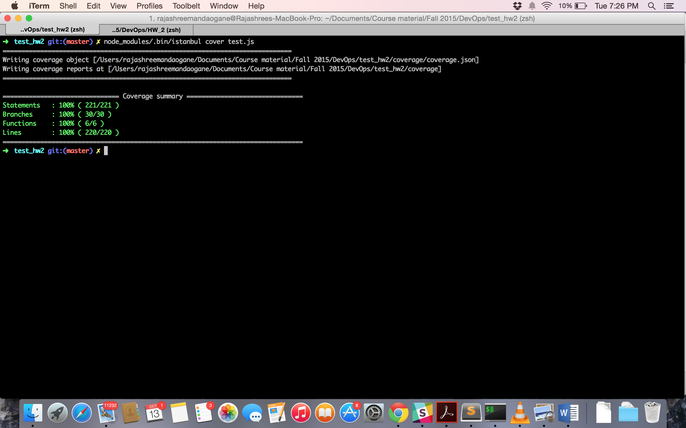

# Test Generation and Coverage

## Run the code
```
node generation.js <file name>
node_modules/.bin/istanbul cover test.js
open coverage/lcov-report/HW2/subject.js.html
```

## Screenshot
This screenshot is for the file subject.js

